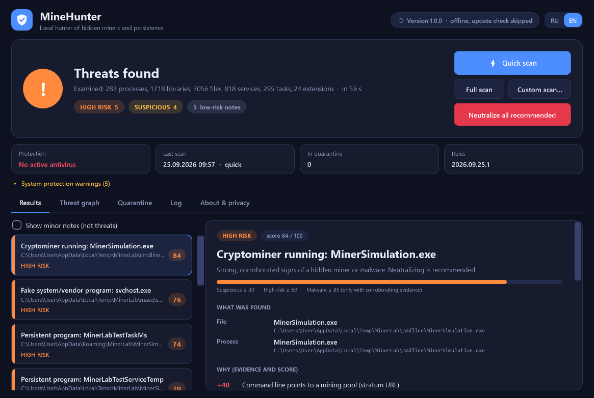
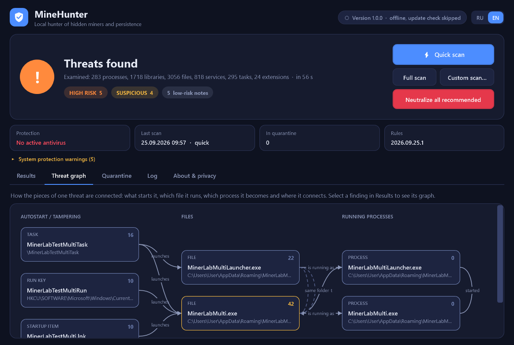

# MineHunter

[Русский](README.ru.md) | English

**Finds and kills hidden cryptominers, their watchdogs and every trick they use to survive a reboot.**
Double-click, wait a minute, read *what* was found, *where*, *why* (evidence and scores) and what to do. It is an auxiliary tool for hunting suspicious processes, autostart entries, tasks, services, WMI subscriptions, browser extensions and files — **not** an antivirus.

[](https://github.com/ilyasaffonovv-commits/MineHunter/actions/workflows/build.yml)
[](https://github.com/ilyasaffonovv-commits/MineHunter/releases/latest)

[](LICENSE)

> [!NOTE]
> ### Some antivirus products may distrust an unsigned tool that talks about miners. The release EXEs contain no miner signatures in plain text (the rules are embedded compressed) and are published with SHA-256 sums. If any scanner flags them — or if MineHunter flags **your normal program** — please open an issue with the *False positive* template: every such report is treated as a bug.

## ⬇ [Download the latest release](https://github.com/ilyasaffonovv-commits/MineHunter/releases/latest)
Windows 10 / 11 x64. Nothing to install: unzip and run `MineHunter.exe` (.NET Framework 4.7.2+ is built into Windows). Administrator rights are requested so that services, tasks, WMI and other users' processes can be seen.



## How to use

1. Unzip the archive into a separate folder and start `MineHunter.exe`.
2. It checks whether a newer version exists (top right) and installs newer detection rules by itself (verified by SHA-256 and an RSA signature).
3. A **Quick scan** starts automatically (~1 minute). **Full scan** walks all fixed drives (first pass ≈ 5–8 min, later passes ≈ 3 min thanks to a cache). **Custom scan** takes a folder or drive.
4. Every finding shows: **what** was found, **where**, **why** (each piece of evidence with its score and category), the **infection chain** (autostart → file → process → network) and the recommended action, with tick-boxes for each step.
5. **Neutralize** stops the processes, removes autostart entries and moves files into a reversible **Quarantine**. Then MineHunter **rescans and only reports success if the rescan confirms it**. Files that are locked are removed on the next reboot.
6. Wrong verdict? **Mark as safe** (by path + SHA-256), or restore anything from the *Quarantine* tab.

Reports are written to `%ProgramData%\MineHunter\Reports` (`report.json`, `report.txt`). The window language switches between RU and EN in the corner.



## What it looks at

| Area | What exactly |
|---|---|
| **Processes & memory** | miner command lines (pool URL, wallet, algorithm), process hollowing (image in memory ≠ file on disk), PE images in private memory, threads outside any module, system-named processes (`svchost.exe`…) running from user folders, impossible parents, DLL side-loading, sustained CPU/GPU load (only ever a *weak* signal) |
| **Network ↔ process** | connections per PID, mining ports, pool domains (via the DNS cache), long-lived external connections of unsigned programs |
| **Autostart** | Run/RunOnce, startup folders, services & drivers (incl. known vulnerable drivers), scheduled tasks (incl. hidden ones, `SD`-stripped tasks and `\Microsoft\…` impostors), WMI subscriptions, Winlogon, IFEO, AppInit, LSA, COM hijacks and more |
| **Windows protection** | Defender exclusions, disabled real-time protection, UAC / SmartScreen / firewall state, hosts-file blocking of security sites, blocked security tools, proxies |
| **Browsers** | Chromium family + Firefox: extensions (mining **code**, not a mere mention in a block-list), risky permissions, search / home-page hijack, launch flags in shortcuts |
| **Files** | static PE analysis (signature, entropy, imports, overlay, bloated files), miner strings, masquerade (fake system names, look-alike folders such as `system92`, fake version info), hidden executables in the Recycle Bin and `AppData\Microsoft\Windows` |

The full rule catalogue with weights is in [docs/RULES.md](docs/RULES.md); what is known about current miner families and tricks (2025–2026) and how it maps to detections is in [docs/THREAT_RESEARCH.md](docs/THREAT_RESEARCH.md).

## Why it does not flag your normal programs

Unsigned, "runs from AppData" or "uses CPU" describe half of all honest software (games, launchers, indie tools). So each signal is a *piece of evidence* with a weight, a category and a cap; **High Risk / Malware needs several independent kinds of evidence to agree** (a definitive miner command line, a masquerading name *and* running from the wrong place, persistence *and* behaviour…). Trusted publishers, OS files and NGEN images reduce a file's own score; data files (block-lists) are not code; installers and helper scripts of signed products are recognised. The score is never a mystery — every number in a verdict traces back to a rule. See [docs/RISK_MODEL.md](docs/RISK_MODEL.md).

## Command line

Use `MineHunter-cli.exe` (same program, console subsystem — it waits and writes to stdout).

| Command | Description |
|:---|:---|
| `scan --quick` / `--full` / `--path <dir>` | choose the scope (default: quick) |
| `--fix [--yes] [--min suspicious\|high\|malware] [--only <text>] [--all-steps]` | neutralize findings (asks for `--yes`; default level: high risk and up; `--only` restricts to items containing the text) |
| `--report-dir <dir>` `--json <file>` `--dump <file>` | where reports go; extra JSON copy; dump every scanned entity with its evidence (research) |
| `--no-browsers` `--no-memory` `--no-files` `--no-cache` `--sample-ms <n>` `--quiet` | speed / scope switches |
| `quarantine list \| restore <id> [--to <path>] \| delete <id> \| delete-all` | quarantine manager |
| `allow <path>` | mark a file safe (path + SHA-256) |
| `update-check` / `update-rules` | check the manifest / install verified rules |
| `markers <file>` | list every miner marker found inside a file (explains "Cryptominer files" findings) |
| `rules-info` · `selftest` · `--version` | loaded rule packs · 55 built-in self checks · version |

Exit codes: `0` clean, `1` suspicious, `2` high-risk/malware, `3` error, `4` confirmation needed (`--yes`).

## Updates

The only network request MineHunter ever makes is a plain HTTPS `GET` of the public [`version.json`](version.json) (and, if newer, [`rules/core.json`](rules/core.json)). Nothing from your PC is sent. A rule pack is installed **only** if its SHA-256 matches the manifest **and** its RSA signature verifies against the public key built into the program; tampered, unsigned or foreign-signed packs are rejected (covered by the self tests, including a full local-server update flow). New program versions are shown as a link to the release page. Details: [docs/UPDATES.md](docs/UPDATES.md).

## Privacy

No accounts, no telemetry, no cloud lookups. Files, hashes and logs never leave the machine. The data folder `%ProgramData%\MineHunter` (quarantine, allow-list, rule updates, reports) is writable only by SYSTEM and administrators.

## Build from source

```
powershell -ExecutionPolicy Bypass -File build_release.ps1 -Zip
```
Needs the .NET SDK only for building; the result runs anywhere on Windows 10/11. Layout: `src/` (C#, WPF, no third-party packages), `rules/` (detection rules, plain JSON), `tests/` (MinerLab — a **benign** infection simulator — and test tools), `docs/`, `tools/` (maintainer scripts).

## Tests & honesty

* `MineHunter-cli.exe selftest` — 55 checks: path classes, rules, signatures, **false-positive calibration**, decision safety, reversible quarantine, registry round-trip, the whole update flow, and "the EXE contains no miner marker".
* MinerLab creates harmless look-alikes (system-named files in wrong places, Run keys, hidden tasks, services, WMI, watchdog chains, loopback sockets), MineHunter is measured against them and everything is removed and diffed against a system snapshot afterwards. Results: [docs/TEST_REPORT.md](docs/TEST_REPORT.md). Comparison with MinerSearch: [docs/COMPARISON.md](docs/COMPARISON.md).
* It is a **heuristic, on-demand** scanner — no kernel driver, no real-time shield. Kernel rootkits and fully encrypted samples with no footprint on disk, in memory or in autostart can be missed. Everything that could not be examined is listed in every report.

## Contributing · Security · License

New detections, false-positive reports and translations are welcome — see [CONTRIBUTING.md](CONTRIBUTING.md). Security issues: [SECURITY.md](SECURITY.md). MIT License.
