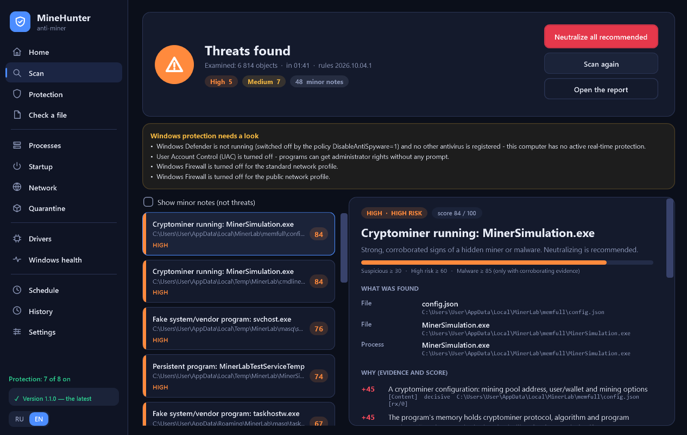
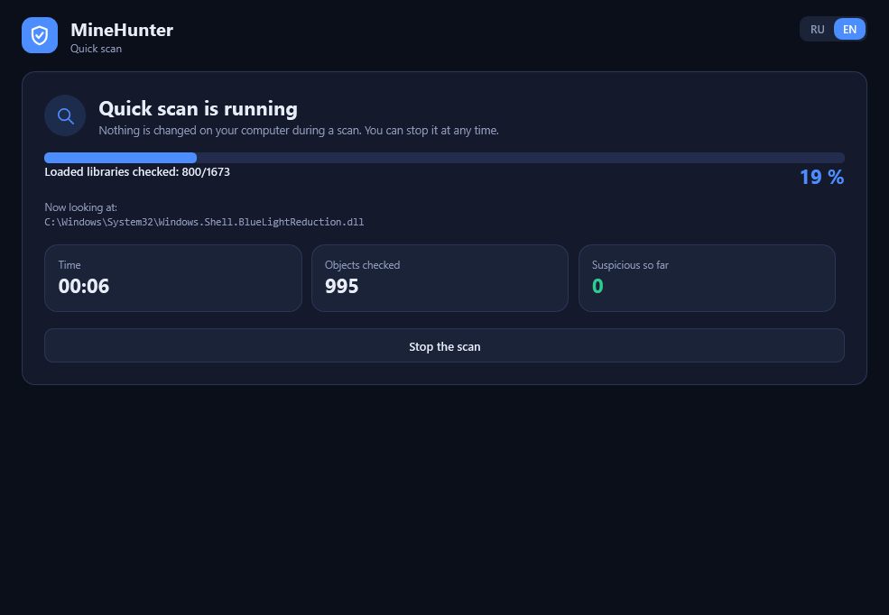
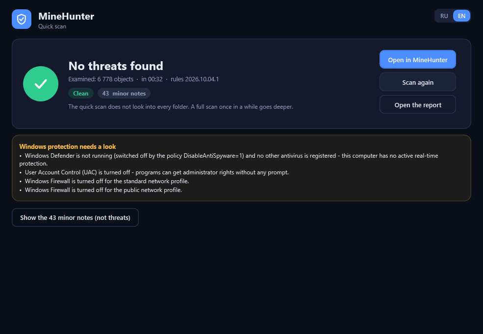
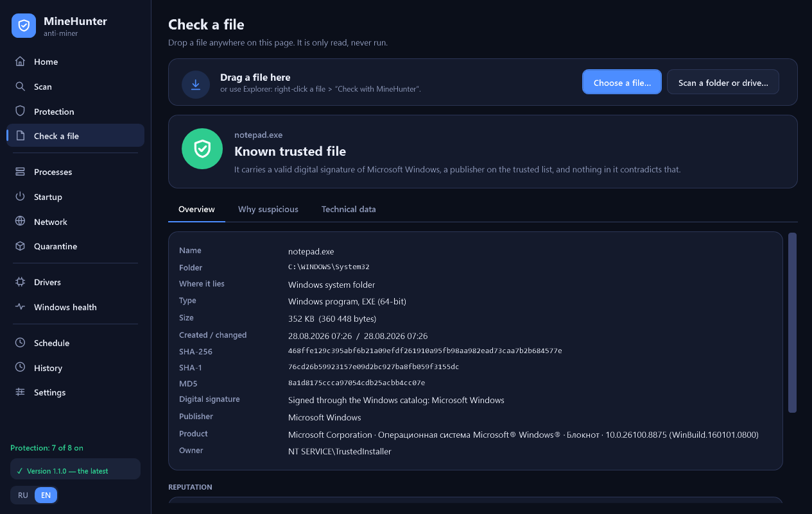
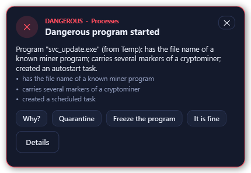

# MineHunter

[Русский](README.ru.md) | English

MineHunter finds hidden cryptominers and the persistence mechanisms they leave behind, on Windows 10/11 x64. It looks at running processes, autostart locations, scheduled tasks, services, WMI subscriptions, drivers, browser extensions and files, shows the evidence behind every finding, and can move what it finds into a quarantine. It works locally, sends nothing about your computer anywhere, and is not an antivirus replacement.

[](https://github.com/ilyasaffonovv-commits/MineHunter/actions/workflows/build.yml)
[](https://github.com/ilyasaffonovv-commits/MineHunter/releases/latest)
[](LICENSE)



*The harmless MinerLab test set found by the quick scan: what was found, where, why (evidence with weights) and what Neutralize would do.*

## Download

This repository is the source code. If you only want to run the program, take `MineHunter-Portable-x64.zip` from the [latest release](https://github.com/ilyasaffonovv-commits/MineHunter/releases/latest), unpack **the whole archive** into a folder (not from inside the archive window) and start one of the programs below. The SHA-256 of the archive is in the release notes. The programs are not code-signed, so Windows SmartScreen may show "Windows protected your PC" on the first start: compare the SHA-256 first, then choose "More info" and "Run anyway".

Requirements: Windows 10 or 11 x64 and .NET Framework 4.7.2 or newer, which is part of current Windows builds. No installer (one is planned). The programs ask for administrator rights; without them services, scheduled tasks, WMI, the registry of other users and other users' processes cannot be read, and the report says so.

If Windows or an antivirus stops it: SmartScreen ("More info", then "Run anyway") is the usual one. A security product may also distrust an unsigned program that reads processes and the registry, which is what a scanner does; I could not test other antivirus products (Defender is off on the test PC). If a file is quarantined by one, restore it, add the unpacked folder to that product's exclusions and run again, and please report the detection name through the false positive template. Nothing in MineHunter changes the PC during a scan; only the Neutralize button does, and it saves what it removes to the quarantine first.

What to expect: on the author's fast PC the first quick scan took 1.5 minutes and the first full scan under 5 minutes; a slower PC or disk will take noticeably longer, the full scan most of all. The window stays responsive and Stop works at any time.

## Three programs, one engine

| File | What it does |
|---|---|
| `MineHunter Quick Scan.exe` | Double click, allow the Windows prompt, and a quick scan starts at once. A live status shows what is being checked, the time, the number of objects and the suspicious items so far. It ends with "No threats found" or the findings with explanations, a Neutralize button and a button that opens them in the main program. |
| `MineHunter Full Scan.exe` | The same for a deep scan of all fixed drives (USB and network drives are optional in Settings). The Stop button is safe at any moment (nothing is changed by a scan; what was checked until then is shown). |
| `MineHunter.exe` | The main program with a dark window and 13 pages (below), a tray icon and the real-time layer. |
| `MineHunter-cli.exe` | The same engine for the console: waits for completion, writes to stdout, returns an exit code. For scripts, CI and remote sessions. |

All four use `components\MineHunter.Core.dll`. The same scan settings give the same result in each of them; the self test checks this. Only one scan runs at a time on a PC (a second start tells you so instead of competing for the disk). An internal helper that installs updates sits in `components\`.

Measured on the author's PC (24 logical cores, about 88,000 objects): the first quick scan 89 s and the first full scan 4 min 47 s (about 70 GB hashed); repeat scans use the cache of files that were already checked and take about 30 s and 2 min. A slower disk or CPU will take longer. See [docs/TEST_REPORT.md](docs/TEST_REPORT.md).

## Pages of the main program

| Page | Contents |
|---|---|
| Home | State at a glance: last scan, protection layer, Windows health, quarantine, one-click Quick and Full scan. |
| Scan | Quick, Full, a chosen folder or drive; profiles; live progress; results with the evidence chain and the Neutralize action. |
| Protection | The eight real-time guards one by one: what each does, its real state (on, off, limited mode, error), a switch for each, game mode and the warning level. |
| Check a file | Drag and drop, a button, or the Explorer right-click menu (switched on in Settings). Verdict in plain words, reasons with weights, signature and certificate chain, hashes, Mark of the Web, PE sections with entropy, imports, URLs, domains, miner markers, reputation. A file is only read, never run. |
| Processes | A tree with trust colours (Windows, signed, unsigned, unknown), CPU and memory, parent chains, actions on a selected process. |
| Startup | Everything that starts by itself in one list, with a safe on/off switch. Nothing is deleted by it. |
| Network | External connections per process, mining ports, a button that creates a Windows Firewall block rule on your click. |
| Quarantine | Saved items with their original place; restore or delete. |
| Drivers | Inventory with signer and age, official vendor pages, Windows Update search. See "Drivers". |
| Windows health | Concrete statements about Defender and its exclusions, firewall, SmartScreen, UAC, updates, Secure Boot, TPM, memory integrity, hosts, proxy, DNS, RDP and more. No made-up score; a fix button only where a safe fix exists. |
| Schedule | Scans through the Windows Task Scheduler: daily, every N days, weekly, monthly; quick, full or chosen folders; run a missed scan at the next start; only when idle; not on battery. |
| History | Past scans with JSON, TXT and one-file HTML reports, the journal of changes to the system that the guards noticed, and the warnings they raised. |
| Settings | Presets (Normal, Strict, Developer), sensitivity (Normal, Strict, Paranoid), CPU limit, exclusions, notifications, game mode, the Explorer menu, optional VirusTotal hash lookup (off by default), update settings, language. |







## What is checked

| Area | Details |
|---|---|
| Processes | Miner command lines (pool URL, wallet, algorithm). System-named processes running outside the Windows folder. Unexpected parent processes. Signed programs that load an unsigned DLL from their own user-writable folder. CPU load, and GPU load when the "GPU Engine" performance counters are available. |
| Process memory | Image header in memory compared with the file on disk (hollowing). PE images in private executable memory. Threads that start outside every loaded module. System utilities left suspended. |
| Network | TCP connections per process, mining ports, pool domains taken from the DNS cache, long-lived external connections of unsigned programs, external connections of programs that normally have none. |
| Autostart | Run and RunOnce keys, startup folders, services and drivers (including known vulnerable drivers), scheduled tasks (hidden ones, tasks with a removed security descriptor, tasks placed under `\Microsoft\`), WMI event subscriptions, Winlogon, IFEO and SilentProcessExit, AppInit_DLLs, AppCertDLLs, LSA packages, HKCU COM registrations and per-user file-type overrides, Session Manager, screensavers, print processors, AppCompat shims, KnownDLLs, profiler variables, BootExecute. The registry hives of other users are read too, also of users who are not signed in. |
| Windows protection | Defender exclusions, disabled real-time protection, UAC, SmartScreen and firewall state, hosts-file entries that block update and security sites, policies that block Task Manager, regedit or listed security tools, firewall rules that allow user-folder programs, Remote Desktop switched on. |
| Browsers | Chrome, Edge, Brave, Opera, Opera GX, Yandex, Vivaldi, Avast Secure Browser, Chromium and Firefox: extension code, risky permissions, forced installs by policy, changed search engine and start page, shortcuts with risky flags. VS Code, Cursor and Windsurf extensions are checked for miner code and for scripts that disable protection. |
| Files | PE analysis (signature, entropy, imports, overlay, padded files), miner strings, system file names in the wrong folder, look-alike folders such as `system92`, executables in the Recycle Bin, NTFS alternate streams, 8.3 names, DLL side-loading pairs. |

The rules are listed in [docs/RULES.md](docs/RULES.md). What they are based on is in [docs/THREAT_RESEARCH.md](docs/THREAT_RESEARCH.md).

A single weak signal never raises an object to High Risk. Being unsigned, running from AppData or using CPU is common in ordinary software, so these signals carry small weights and caps. High Risk needs a definitive item (for example a complete miner command line) or evidence from at least two independent categories. Signed files from known publishers and Windows components have their weak signals reduced. Sensitivity "Strict" and "Paranoid" lower the thresholds for Suspicious and High Risk but never the bar for Malware. The preset "Developer" ignores weak signals inside `node_modules`, virtual environments and build folders. [docs/RISK_MODEL.md](docs/RISK_MODEL.md) has the exact rules.

Findings are graded Suspicious, High Risk or Malware. Items with a low score are listed separately as notes and are not threats.

## Real-time layer

While the main program or its tray icon is running, a set of guards watches and reports: File Guard, Download Guard, Process Guard (parent chains and command lines), Script Guard (reads AMSI as a client), Persistence Guard (with a journal of system changes), Network Guard, USB Guard and, if you switch it on, Ransomware Guard with decoy files. A warning needs several independent signs and says what concretely happened. This is monitoring in user mode, not a blocker: it reports after the event and does not claim to stop a program before it starts. How the signals are combined is described in [docs/PROTECTION.md](docs/PROTECTION.md).



## Drivers

The page lists installed drivers with signer, version and age and marks the ones on the list of known vulnerable drivers. Updates come only from official sources (the vendor's page or Windows Update). An install checks the Hardware ID, creates a restore point and keeps a copy of the old driver for a roll-back. BIOS and firmware are never installed by the program, and storage and chipset drivers need an explicit confirmation. Real driver installs were not tested (see Limitations).

## What can be fixed

Neutralize runs the selected steps of a finding: freeze the processes, remove autostart entries, kill the processes, move the files to quarantine. It then scans again and reports a finding as fixed only if the second scan no longer sees it. By default only the steps for High Risk and Malware findings are selected, and game cheats and hack tools are kept unless you ask. Critical Windows processes and trusted system files are never touched.

- Files, scheduled tasks, services, registry values, WMI subscriptions, Defender exclusions, hosts entries and browser extensions are saved before removal and can be restored from the Quarantine page. Quarantined files are stored XOR-masked and checked against their SHA-256 on restore.
- Firewall rules are removed and only recorded, they are not restored automatically. A killed process cannot be brought back.
- A file that is locked is renamed and deleted on the next reboot.
- "Mark as safe" adds a file (path and SHA-256) to an allow list. Wrong verdicts can be turned into a text report with the names removed (never sent by the program) and posted with the false positive issue template.

## Command line

```
MineHunter-cli.exe quick | full                       the same as scan --quick | --full
MineHunter-cli.exe scan [--quick | --full | --path <dir>] [--fix [--yes] [--min suspicious|high|malware] [--only <text>] [--all-steps]]
                        [--report-dir <dir>] [--json <file>] [--no-browsers] [--no-memory] [--no-files] [--no-cache] [--quiet]
MineHunter-cli.exe check <file> [--deep]              verdict, reasons, signature, hashes (--deep: sections, imports, strings, certificate chain)
MineHunter-cli.exe hash <file> | reputation <sha256>
MineHunter-cli.exe status | health | processes | connections | startup | drivers | history
MineHunter-cli.exe quarantine list | restore <id> [--to <path>] | delete <id> | delete-all
MineHunter-cli.exe allow <path>
MineHunter-cli.exe update-check | update-rules | rules-info | markers <file> | selftest | --version
```

`--fix` asks for confirmation unless `--yes` is given. `--only` limits it to findings whose files, paths or names contain the text. `--dump <file>` writes every scanned object with its evidence. Exit codes: 0 clean, 1 suspicious, 2 high risk or malware, 3 error, 4 confirmation needed. `MineHunter.exe` accepts the same commands.

Reports are written as `report.json` and `report.txt` to a `Reports` folder next to the programs. Nothing in a report is sensitive (no quarantine content, no settings), only what was found and why.

## Updates and privacy

There is no telemetry. The only network requests are HTTPS GETs of [`version.json`](version.json) and, when newer, [`rules/core.json`](rules/core.json) and the release archive; nothing about the computer is sent. A rule pack is installed only if its SHA-256 matches the manifest and its RSA signature verifies against the public key built into the program. A new program version can be downloaded automatically but is installed only after your click, and only if the announcement is signed, the archive's SHA-256 and size match, and the unpacking stays inside the target folder; a separate helper then replaces the files after the program closes, keeps a backup and rolls back on any failure. Both can be switched off on the Settings page. Details are in [docs/UPDATES.md](docs/UPDATES.md).

The optional reputation lookup at VirusTotal is off by default, needs your own key and sends only the SHA-256 of a file.

Everything the program needs to protect (quarantined files, the allow list, downloaded rule updates, history, the journal) lives in `%ProgramData%\MineHunter`, which only SYSTEM and administrators can write to. This is deliberate: it is what stops a miner running as an ordinary user from marking itself as safe, restoring itself from quarantine or planting a fake rule update. Scan settings are in `config.json` next to the programs.

## Limitations

- The checks are heuristic. There is no kernel driver. The real-time layer is monitoring in user mode, not a blocker. Kernel rootkits and samples that leave no trace on disk, in memory or in autostart can be missed. Whatever could not be examined (protected processes, folders without access, a scan stopped by its time limit) is listed in the report.
- It has not been run against real malware samples. Testing used the harmless simulator in `tests/MinerLab`, lab files for the guards and real machines. A real ransomware sample, a real AMSI detection, a real USB stick and a real driver install were not tested. Windows 10 and low-end hardware were not tested.
- There is no MineHunter cloud service. The reputation page can only say what a local list and, if you switch it on, VirusTotal say; "no data" does not mean "safe".
- The executables are not code-signed. Some antivirus products distrust unsigned programs. The programs contain no miner strings in plain text (the rule pack is embedded compressed and the self test checks the files for markers), but a scanner may still flag them. Please report that, and any normal program that MineHunter flags, with the false positive template.
- No installer yet; the portable archive is complete.
- The detailed documentation in `docs/` is in Russian.

## Build

```
powershell -ExecutionPolicy Bypass -File build_release.ps1 -Zip
```

This needs the .NET SDK. It builds the solution `src/MineHunter.sln`, puts the four programs and `components\` next to the script and, with `-Zip`, writes `dist\MineHunter-Portable-x64.zip`. The sources are C# for .NET Framework 4.7.2 with WPF and no third-party packages.

Layout: `src/MineHunter.Core` engine (scanners, rules, risk, quarantine, guards, update, command line), `src/MineHunter.UI` window library, `src/MineHunter*` thin programs, `src/MineHunter.UpdateHelper` the installer of updates, `rules/` rule pack (JSON), `tests/` test suites and MinerLab, `docs/`, `tools/` maintainer scripts. See [docs/ARCHITECTURE.md](docs/ARCHITECTURE.md).

## Tests

`MineHunter-cli.exe selftest` runs the built-in checks (356 in this version, the count is printed at the end): path handling, rules and their sample lines, signature checks, scoring on known harmless combinations, quarantine round trips, the update flow against a local server, the product layer (settings, profiles, history, schedule, health, file analysis, guards, reputation) and the marker check of the programs themselves. It uses no network and changes nothing outside a temporary folder.

Further suites, all in `tests/`: update helper tests (apply, roll back, locked file, damaged archive), a live test of the guards in the running program, operations tests (damaged config and cache, no network, two scans at once, cancel, locked folder, no administrator rights, a second disk, a program started without its files), robustness tests (broken and huge files, junction loops, a path over 260 characters), and an adversarial life cycle of 35 harmless persistence imitations (detect, explain, quarantine, re-scan, restore, relapse, clean up). MinerLab creates harmless look-alikes of miner infections; every object points at the lab's own harmless program and a cleanup script removes everything again. Results and what was not tested are in [docs/TEST_REPORT.md](docs/TEST_REPORT.md). A comparison with MinerSearch is in [docs/COMPARISON.md](docs/COMPARISON.md).

## Contributing, security, license

Rule proposals and reports of false positives or missed detections are welcome, see [CONTRIBUTING.md](CONTRIBUTING.md). Report vulnerabilities as described in [SECURITY.md](SECURITY.md). MIT license.
