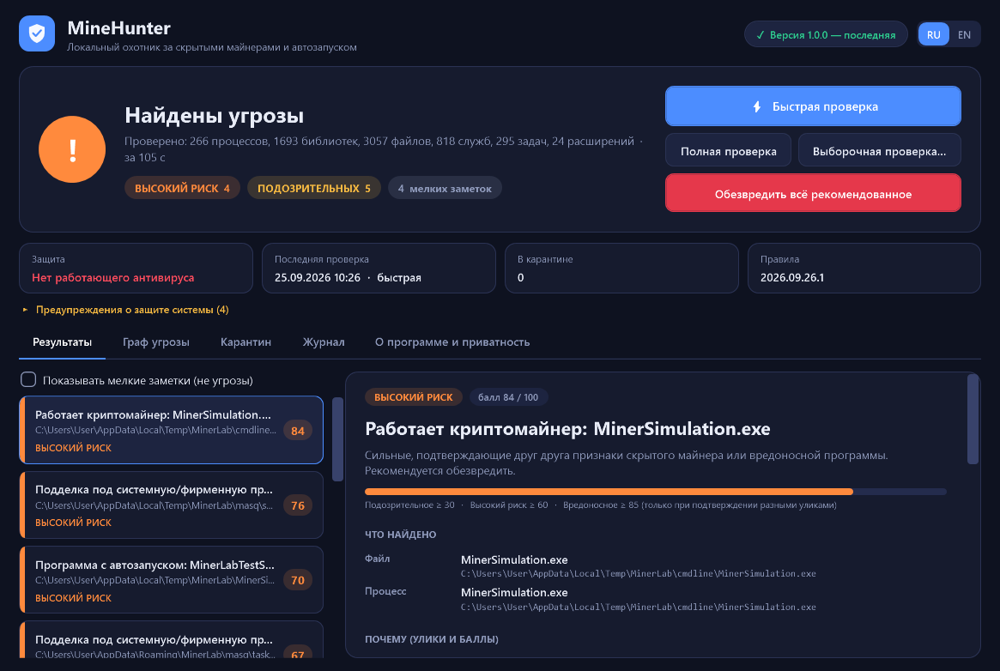
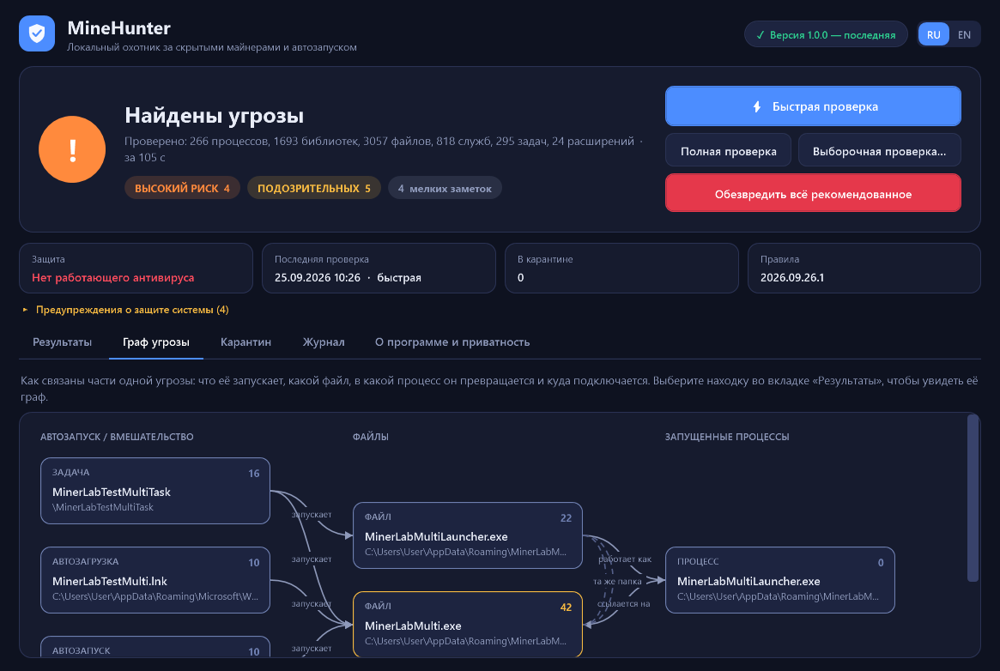

# MineHunter

Русский | [English](README.md)

MineHunter ищет скрытые криптомайнеры и следы их закрепления в системе, Windows 10/11 x64. Он просматривает запущенные процессы, автозапуск, задачи планировщика, службы, WMI-подписки, расширения браузеров и файлы, показывает улики по каждой находке и может переместить найденное в карантин. Проверка запускается вручную; антивирусом программа не является.

[](https://github.com/ilyasaffonovv-commits/MineHunter/actions/workflows/build.yml)
[](https://github.com/ilyasaffonovv-commits/MineHunter/releases/latest)
[](LICENSE)



## Скачать

Возьмите `MineHunter-v1.0.0.zip` на странице [последнего релиза](https://github.com/ilyasaffonovv-commits/MineHunter/releases/latest), распакуйте в отдельную папку и запустите `MineHunter.exe`. SHA-256 архива указан в описании релиза.

Требования: Windows 10 или 11 x64 и .NET Framework 4.7.2 или новее, он уже входит в актуальные сборки Windows. Установщика нет. Программа запрашивает права администратора: без них не видны службы, задачи планировщика, WMI и процессы других пользователей.

## Запуск

При старте MineHunter скачивает `version.json` из этого репозитория (без сети шаг пропускается), ставит более новый пакет правил, если он опубликован, и запускает быструю проверку. То и другое отключается на вкладке «О программе».

- Быстрая: процессы, автозапуск, задачи, службы, WMI, настройки защиты, браузеры и типичные места подброса (Temp, AppData, Downloads, Рабочий стол, ProgramData, корни дисков).
- Полная: все фиксированные диски, останавливается через 45 минут. Результаты для неизменившихся файлов кэшируются, поэтому повторные проверки быстрее.
- Выборочная: одна папка или диск.

Замеры на компьютере автора (24 логических ядра, около 82 000 файлов на фиксированных дисках): быстрая проверка 50–60 с при тёплом кэше и около 110 с при холодном; полная 5–8,5 минут в первый раз и от 2 мин 45 с до 4 мин 10 с при тёплом кэше. На более медленном диске или процессоре времени уйдёт больше. См. [docs/TEST_REPORT.md](docs/TEST_REPORT.md).

Находки делятся на «Подозрительное», «Высокий риск» и «Вредоносное». Объекты с низким баллом показываются отдельно как заметки и угрозами не считаются. Для каждой находки показано, что это, где лежит, все улики с баллами, цепочка (запись автозапуска, файл, процесс, соединение) и предлагаемые действия.



## Что проверяется

| Область | Подробности |
|---|---|
| Процессы | Командные строки майнеров (адрес пула, кошелёк, алгоритм). Процессы с системными именами вне папки Windows. Неожиданные родительские процессы. Подписанные программы, загрузившие неподписанную DLL из своей же пользовательской папки. Нагрузка на CPU и, если доступны счётчики «GPU Engine», на GPU. |
| Память процессов | Заголовок образа в памяти сравнивается с файлом на диске (подмена образа, hollowing). PE-образы в приватной исполняемой памяти. Потоки, стартовавшие вне всех загруженных модулей. Системные утилиты, оставленные в приостановленном состоянии. |
| Сеть | TCP-соединения по процессам, порты майнинга, домены пулов из DNS-кэша, долгие внешние соединения неподписанных программ, внешние соединения у программ, которые обычно их не имеют (`dwm.exe`, `InstallUtil.exe` и подобные). |
| Автозапуск | Ключи Run и RunOnce, папки автозагрузки, службы и драйверы (включая известные уязвимые драйверы), задачи планировщика (скрытые, с удалённым дескриптором безопасности, размещённые под `\Microsoft\`), WMI-подписки на события, Winlogon, IFEO и SilentProcessExit, AppInit_DLLs, AppCertDLLs, пакеты LSA, COM-регистрации в HKCU, переменные окружения профилировщика, BootExecute. |
| Защита Windows | Исключения Защитника, отключённая защита в реальном времени, состояние UAC, SmartScreen и брандмауэра, записи в hosts, блокирующие сайты обновлений и безопасности, политики, запрещающие диспетчер задач, regedit или перечисленные средства безопасности, правила брандмауэра для программ из пользовательских папок. |
| Браузеры | Chrome, Edge, Brave, Opera, Opera GX, Яндекс, Vivaldi, Avast Secure Browser, Chromium и Firefox: код расширений, опасные разрешения, принудительная установка по политике, подмена поиска и стартовой страницы, ярлыки браузеров с опасными параметрами. Расширения VS Code, Cursor и Windsurf проверяются на код майнера и на скрипты, отключающие защиту. |
| Файлы | Анализ PE (подпись, энтропия, импорты, оверлей, раздутые файлы), строки майнеров, имена системных файлов не в своей папке, папки-двойники вроде `system92`, исполняемые файлы в корзине и в `AppData\Microsoft\Windows`. |

Список правил: [docs/RULES.md](docs/RULES.md). На чём основаны правила: [docs/THREAT_RESEARCH.md](docs/THREAT_RESEARCH.md).

Один слабый признак не поднимает объект до «Высокого риска». Отсутствие подписи, запуск из AppData и нагрузка на процессор встречаются у обычных программ, поэтому у таких признаков малый вес и потолок. Для высокого риска нужна решающая улика (например, полная командная строка майнера) или улики как минимум двух независимых категорий. У подписанных файлов известных издателей и компонентов Windows собственные слабые признаки ослабляются. Точные правила: [docs/RISK_MODEL.md](docs/RISK_MODEL.md).

## Что можно исправить

«Обезвредить» выполняет выбранные шаги находки: замораживает процессы, удаляет записи автозапуска, завершает процессы, переносит файлы в карантин. Затем запускается повторная проверка, и находка считается исправленной, только если повторная проверка её больше не видит. По умолчанию отмечены только шаги для находок «Высокий риск» и «Вредоносное». Критические процессы Windows и доверенные системные файлы не затрагиваются.

- Файлы, задачи планировщика, службы, значения реестра, WMI-подписки, исключения Защитника, записи hosts и расширения браузеров перед удалением сохраняются и восстанавливаются на вкладке «Карантин». Файлы в карантине хранятся замаскированными (XOR), при восстановлении сверяется SHA-256.
- Правила брандмауэра удаляются и только записываются, автоматически они не восстанавливаются. Завершённый процесс вернуть нельзя.
- Занятый файл переименовывается и удаляется при следующей перезагрузке.
- «Пометить как безопасное» добавляет файл (путь и SHA-256) в список исключений. О неверном вердикте можно сообщить через шаблон issue «False positive».

## Ограничения

- Проверки эвристические и запускаются по запросу. Драйвера ядра и защиты в реальном времени нет. Руткиты уровня ядра и образцы, не оставляющие следов на диске, в памяти и в автозапуске, могут быть пропущены. Всё, что проверить не удалось (защищённые процессы, папки без доступа, проверка, остановленная лимитом времени), перечислено в отчёте.
- На настоящих образцах вредоносного ПО программа не запускалась. Тесты проводились на безвредном симуляторе `tests/MinerLab` и на одном реальном компьютере. Windows 10 и слабое железо не проверялись.
- Исполняемые файлы не подписаны кодовой подписью. Некоторые антивирусы относятся к неподписанным программам с недоверием. В EXE нет строк майнеров открытым текстом (пакет правил вшит в сжатом виде, самотест проверяет EXE на маркеры), но сканер всё равно может его пометить. Сообщите об этом, а также о любой обычной программе, которую MineHunter пометил, через шаблон «False positive».
- Подробная документация в `docs/` написана по-русски.

## Командная строка

`MineHunter-cli.exe` это та же программа, собранная как консольное приложение: она дожидается завершения и пишет в stdout.

```
MineHunter-cli.exe scan [--quick | --full | --path <папка>] [--fix [--yes] [--min suspicious|high|malware] [--only <текст>] [--all-steps]]
                        [--report-dir <папка>] [--json <файл>] [--dump <файл>]
                        [--no-browsers] [--no-memory] [--no-files] [--no-cache] [--sample-ms <n>] [--quiet]
MineHunter-cli.exe quarantine list | restore <id> [--to <путь>] | delete <id> | delete-all
MineHunter-cli.exe allow <путь>
MineHunter-cli.exe update-check | update-rules
MineHunter-cli.exe markers <файл>
MineHunter-cli.exe rules-info | selftest | --version
```

`--fix` спрашивает подтверждение, если не указан `--yes`. `--only` ограничивает действие находками, в файлах, путях или именах которых есть заданный текст. `--dump` записывает все просмотренные объекты вместе с уликами. `markers` перечисляет маркеры майнеров, найденные внутри файла.

Коды выхода: 0 чисто, 1 подозрительное, 2 высокий риск или вредоносное, 3 ошибка, 4 нужно подтверждение.

Отчёты сохраняются в `%ProgramData%\MineHunter\Reports` как `report.json` и `report.txt`.

## Обновления и приватность

Единственный сетевой запрос это HTTPS GET файла [`version.json`](version.json) и, если он новее, файла [`rules/core.json`](rules/core.json). Сведения о компьютере не отправляются. Пакет правил устанавливается, только если его SHA-256 совпадает с манифестом, а подпись RSA проверяется открытым ключом, встроенным в программу. Новая версия программы показывается ссылкой на страницу релиза и автоматически не ставится. Подробности: [docs/UPDATES.md](docs/UPDATES.md).

Папка данных `%ProgramData%\MineHunter` (карантин, список исключений, скачанные правила, отчёты) доступна для записи только SYSTEM и администраторам.

## Сборка

```
powershell -ExecutionPolicy Bypass -File build_release.ps1 -Zip
```

Нужен .NET SDK. Скрипт кладёт `MineHunter.exe` и `MineHunter-cli.exe` рядом с собой, а с ключом `-Zip` ещё и `dist\MineHunter-v<версия>.zip`. Исходники: C# для .NET Framework 4.7.2, WPF, без сторонних пакетов.

Структура: `src/` программа, `rules/` пакет правил (JSON), `tests/` MinerLab и вспомогательные скрипты, `docs/`, `tools/` скрипты сопровождающего.

## Тесты

`MineHunter-cli.exe selftest` выполняет встроенные проверки (в сборке 1.0.0 их 60, число выводится в конце): обработка путей, правила и их примеры строк, проверка подписей, оценка риска на заведомо безобидных сочетаниях признаков, циклы «карантин и восстановление», процесс обновления с локальным сервером и проверка самого EXE на маркеры. Сеть не используется, вне временной папки ничего не меняется.

MinerLab (`tests/MinerLab`) создаёт безвредные подобия заражения майнером: файлы с системными именами не в своих папках, ключи Run, скрытые задачи, службы, WMI-подписки, цепочки watchdog и loopback-сокеты. Все объекты указывают на собственный безвредный исполняемый файл лаборатории, а скрипт очистки удаляет всё обратно. Результаты: [docs/TEST_REPORT.md](docs/TEST_REPORT.md). Сравнение с MinerSearch: [docs/COMPARISON.md](docs/COMPARISON.md).

## Участие, безопасность, лицензия

Предложения по правилам и сообщения о ложных срабатываниях и пропущенных угрозах приветствуются, см. [CONTRIBUTING.md](CONTRIBUTING.md). Об уязвимостях сообщайте так, как описано в [SECURITY.md](SECURITY.md). Лицензия MIT.
