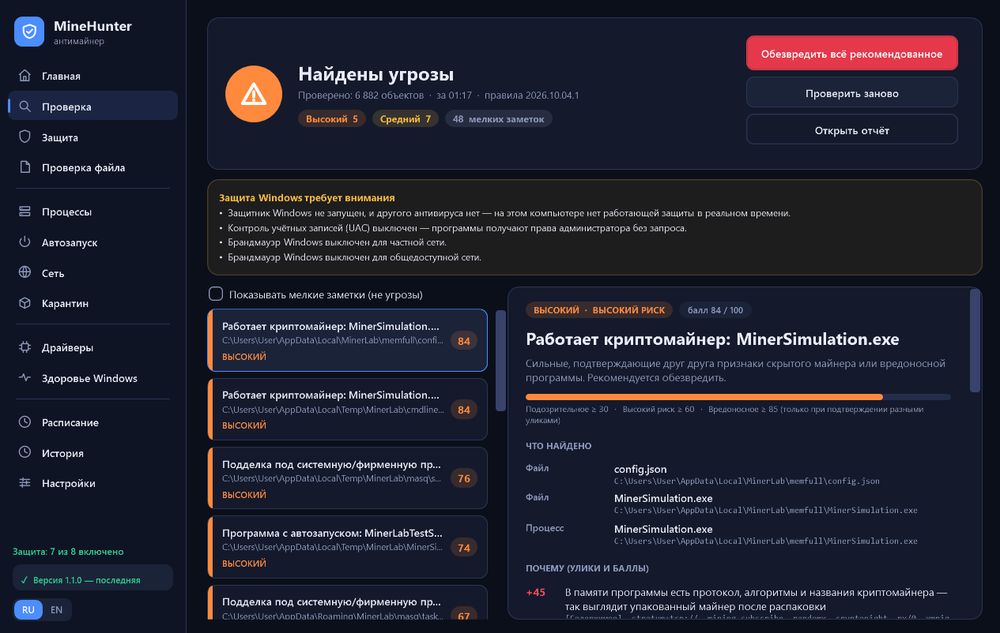
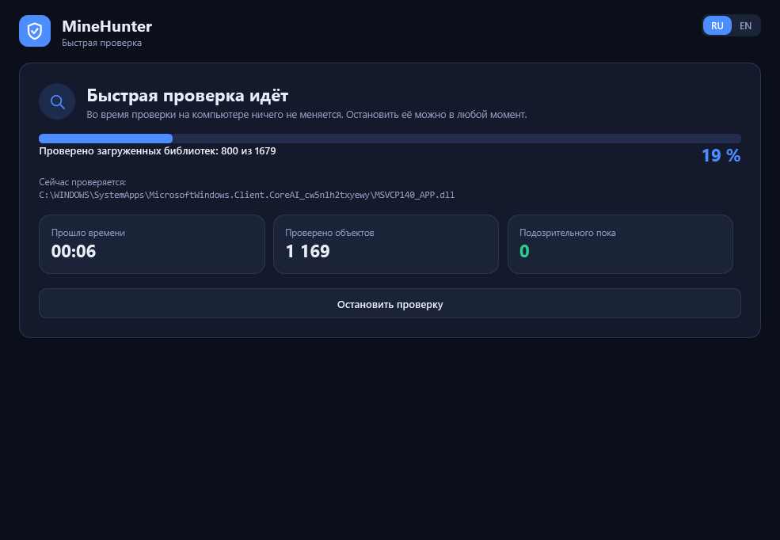
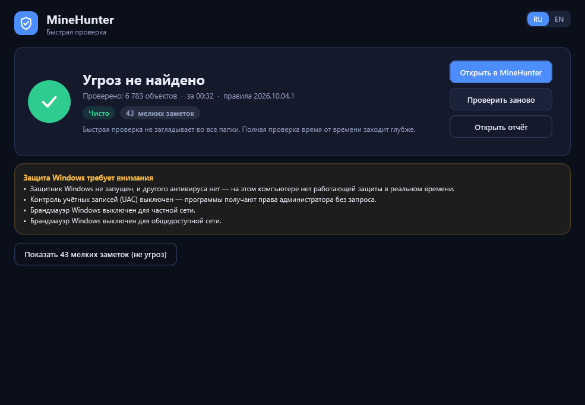
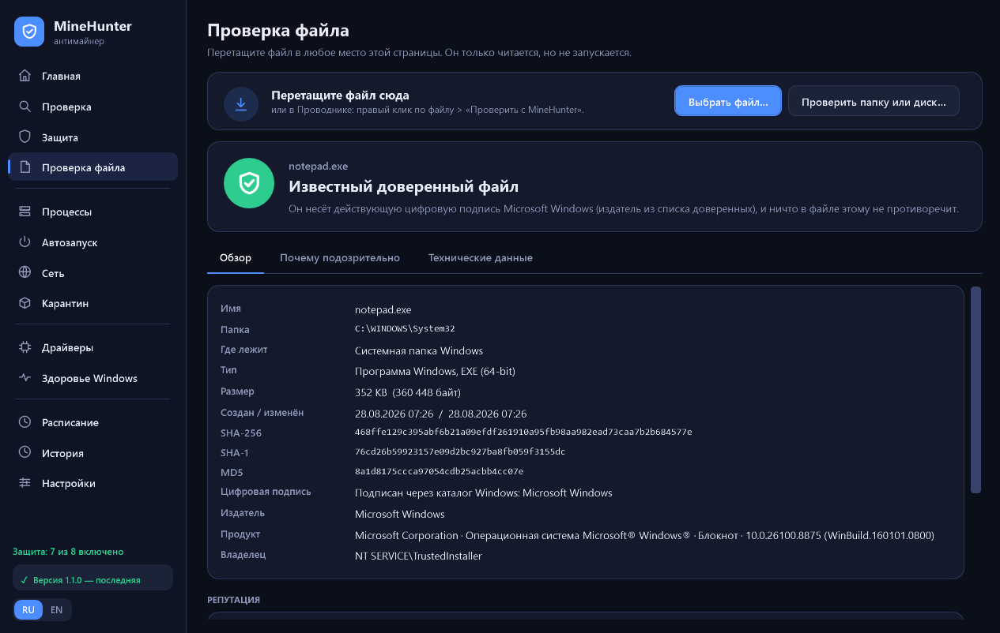
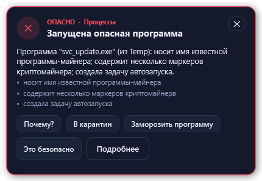

# MineHunter

Русский | [English](README.md)

MineHunter находит скрытые криптомайнеры и то, чем они закрепляются в системе, на Windows 10/11 x64. Он смотрит запущенные процессы, автозапуск, задачи планировщика, службы, подписки WMI, драйверы, расширения браузеров и файлы, показывает доказательства по каждой находке и может убрать найденное в карантин. Работает локально, ничего о вашем компьютере никуда не отправляет и не заменяет антивирус.

[](https://github.com/ilyasaffonovv-commits/MineHunter/actions/workflows/build.yml)
[](https://github.com/ilyasaffonovv-commits/MineHunter/releases/latest)
[](LICENSE)



*Безвредный тестовый набор MinerLab, найденный быстрой проверкой: что найдено, где, почему (улики с весами) и что сделает «Обезвредить».*

## Скачать

Здесь лежит исходный код. Если нужна только программа, возьмите `MineHunter-Portable-x64.zip` из [последнего релиза](https://github.com/ilyasaffonovv-commits/MineHunter/releases/latest), распакуйте **весь архив** в папку (не запускайте из окна архива) и откройте одну из программ ниже. SHA-256 архива указан в описании релиза. Программы не подписаны цифровой подписью, поэтому при первом запуске SmartScreen может показать «Windows защитила ваш компьютер»: сначала сверьте SHA-256, потом нажмите «Подробнее» и «Выполнить в любом случае».

Нужны Windows 10 или 11 x64 и .NET Framework 4.7.2 или новее, он входит в актуальные сборки Windows. Установщика нет (он запланирован). Программы просят права администратора: без них нельзя прочитать службы, задачи планировщика, WMI, реестр других пользователей и чужие процессы, и отчёт об этом говорит.

Если Windows или антивирус останавливает запуск: чаще всего это SmartScreen («Подробнее», затем «Выполнить в любом случае»). Защитный продукт может также не доверять неподписанной программе, которая читает процессы и реестр, а именно это делает сканер; другие антивирусы я проверить не мог (на тестовом компьютере Defender выключен). Если файл ушёл в карантин антивируса, восстановите его, добавьте распакованную папку в исключения этого антивируса и запустите снова, а название срабатывания пришлите по шаблону о ложном срабатывании. Во время проверки MineHunter ничего на компьютере не меняет; меняет только кнопка «Обезвредить», и она сначала сохраняет удаляемое в карантин.

Чего ждать: на быстром компьютере автора первая быстрая проверка заняла 1,5 минуты, первая полная меньше 5 минут; на более медленном компьютере или диске будет заметно дольше, особенно полная. Окно не зависает, «Остановить» работает в любой момент.

## Три программы, один движок

| Файл | Что делает |
|---|---|
| `MineHunter Quick Scan.exe` | Двойной щелчок, согласие в окне Windows, и сразу запускается быстрая проверка. Живой статус показывает, что проверяется, время, число объектов и найденное подозрительное. В конце: «Угроз не найдено» или находки с объяснениями, кнопкой «Обезвредить» и кнопкой, которая открывает их в главной программе. |
| `MineHunter Full Scan.exe` | То же для глубокой проверки всех постоянных дисков (USB и сетевые диски включаются в настройках). Кнопка «Остановить» безопасна в любой момент (проверка ничего не меняет; показывается то, что успели проверить). |
| `MineHunter.exe` | Главная программа: тёмное окно с 13 страницами (ниже), значок в трее и слой защиты в реальном времени. |
| `MineHunter-cli.exe` | Тот же движок для консоли: ждёт завершения, пишет в stdout, возвращает код выхода. Для скриптов, CI и удалённых сессий. |

Все четыре используют `components\MineHunter.Core.dll`. Одни и те же настройки проверки дают один и тот же результат в каждой из них, самотест это проверяет. На компьютере одновременно идёт только одна проверка (второй запуск сообщает об этом, а не спорит за диск). Служебный помощник, который ставит обновления, лежит в `components\`.

Замеры на компьютере автора (24 логических ядра, около 88 000 объектов): первая быстрая проверка 89 с, первая полная 4 мин 47 с (около 70 ГБ хеширования); повторные проверки используют кэш уже проверенных файлов и занимают около 30 с и 2 мин. На более медленном диске или процессоре будет дольше. См. [docs/TEST_REPORT.md](docs/TEST_REPORT.md).

## Страницы главной программы

| Страница | Что там |
|---|---|
| Главная | Состояние одним взглядом: последняя проверка, слой защиты, здоровье Windows, карантин, кнопки быстрой и полной проверки. |
| Проверка | Быстрая, полная, выбранная папка или диск; профили; живой ход; результаты с цепочкой доказательств и действием «Обезвредить». |
| Защита | Восемь стражей реального времени по одному: что делает каждый, его настоящее состояние (включён, выключен, ограниченный режим, ошибка), переключатель у каждого, игровой режим и уровень предупреждений. |
| Проверка файла | Перетащить файл, кнопка или пункт в контекстном меню проводника (включается в настройках). Вердикт простыми словами, причины с весами, подпись и цепочка сертификатов, хеши, метка «из интернета», секции PE с энтропией, импорты, адреса, маркеры майнеров, репутация. Файл только читается, никогда не запускается. |
| Процессы | Дерево с цветами доверия (Windows, подписанные, неподписанные, неизвестные), CPU и память, цепочки родителей, действия над выбранным процессом. |
| Автозапуск | Всё, что запускается само, одним списком с безопасным переключателем. Ничего не удаляется. |
| Сеть | Внешние соединения по процессам, порты майнинга, кнопка создаёт правило блокировки в брандмауэре Windows по вашему щелчку. |
| Карантин | Сохранённое с исходным местом; восстановить или удалить. |
| Драйверы | Список с издателем и возрастом, официальные страницы производителей, поиск в Центре обновления. См. «Драйверы». |
| Здоровье Windows | Конкретные утверждения про Defender и его исключения, брандмауэр, SmartScreen, UAC, обновления, Secure Boot, TPM, целостность памяти, hosts, прокси, DNS, RDP и другое. Без выдуманной оценки; кнопка исправления только там, где есть безопасное исправление. |
| Расписание | Проверки через планировщик Windows: ежедневно, раз в N дней, еженедельно, ежемесячно; быстрая, полная или выбранные папки; догнать пропущенную при следующем запуске; только в простое; не от батареи. |
| История | Прошлые проверки с отчётами JSON, TXT и HTML одним файлом, журнал изменений в системе, которые заметили стражи, и их предупреждения. |
| Настройки | Профили (Обычный, Строгий, Разработчик), чувствительность (Обычная, Строгая, Параноидальная), лимит CPU, исключения, уведомления, игровой режим, пункт в меню проводника, необязательный запрос хеша в VirusTotal (по умолчанию выключен), обновления, язык. |







## Что проверяется

| Область | Подробности |
|---|---|
| Процессы | Командные строки майнеров (адрес пула, кошелёк, алгоритм). Процессы с системными именами вне папки Windows. Неожиданные родительские процессы. Подписанные программы, которые загружают неподписанную DLL из своей папки, доступной пользователю для записи. Нагрузка CPU и, если доступны счётчики «GPU Engine», нагрузка GPU. |
| Память процессов | Заголовок образа в памяти в сравнении с файлом на диске (hollowing). PE-образы в приватной исполняемой памяти. Потоки, которые стартуют вне всех загруженных модулей. Системные утилиты, оставленные в приостановленном состоянии. |
| Сеть | TCP-соединения по процессам, порты майнинга, домены пулов из кэша DNS, долгие внешние соединения неподписанных программ, внешние соединения программ, у которых их обычно нет. |
| Автозапуск | Ключи Run и RunOnce, папки автозагрузки, службы и драйверы (включая известные уязвимые драйверы), задачи планировщика (скрытые, с удалённым дескриптором безопасности, помещённые в `\Microsoft\`), подписки WMI, Winlogon, IFEO и SilentProcessExit, AppInit_DLLs, AppCertDLLs, пакеты LSA, регистрации COM и переопределения типов файлов в HKCU, Session Manager, заставки, процессоры печати, AppCompat-шимы, KnownDLLs, переменные профилировщика, BootExecute. Читаются и кусты реестра других пользователей, в том числе не вошедших в систему. |
| Защита Windows | Исключения Defender, отключённая защита в реальном времени, UAC, состояние SmartScreen и брандмауэра, записи hosts, блокирующие сайты обновлений и безопасности, политики, блокирующие диспетчер задач, regedit или перечисленные защитные программы, правила брандмауэра для программ из пользовательских папок, включённый удалённый рабочий стол. |
| Браузеры | Chrome, Edge, Brave, Opera, Opera GX, Яндекс, Vivaldi, Avast Secure Browser, Chromium и Firefox: код расширений, рискованные разрешения, принудительная установка политикой, изменённые поисковая система и стартовая страница, ярлыки с рискованными ключами. Расширения VS Code, Cursor и Windsurf проверяются на код майнера и на скрипты, отключающие защиту. |
| Файлы | Анализ PE (подпись, энтропия, импорты, оверлей, раздутые файлы), строки майнеров, системные имена файлов не в своих папках, похожие папки вроде `system92`, исполняемые файлы в корзине, альтернативные потоки NTFS, короткие имена 8.3, пары для подмены DLL. |

Правила перечислены в [docs/RULES.md](docs/RULES.md). На чём они основаны — в [docs/THREAT_RESEARCH.md](docs/THREAT_RESEARCH.md).

Один слабый признак никогда не поднимает объект до «Высокого риска». Отсутствие подписи, запуск из AppData или нагрузка на CPU встречаются у обычных программ, поэтому у таких признаков малые веса и потолки. Для «Высокого риска» нужен определяющий признак (например, полная командная строка майнера) или доказательства как минимум из двух независимых категорий. У подписанных файлов известных издателей и компонентов Windows слабые признаки уменьшаются. Чувствительность «Строгая» и «Параноидальная» снижает пороги для «Подозрительного» и «Высокого риска», но никогда не планку для «Вредоносного». Профиль «Разработчик» игнорирует слабые признаки внутри `node_modules`, виртуальных окружений и папок сборки. Точные правила — в [docs/RISK_MODEL.md](docs/RISK_MODEL.md).

Находки делятся на «Подозрительное», «Высокий риск» и «Вредоносное». Объекты с малой оценкой показаны отдельно как заметки и угрозами не считаются.

## Слой реального времени

Пока работает главная программа или её значок в трее, за системой следит набор стражей и сообщает о найденном: File Guard, Download Guard, Process Guard (цепочки родителей и командные строки), Script Guard (читает AMSI как клиент), Persistence Guard (с журналом изменений системы), Network Guard, USB Guard и, если включить, Ransomware Guard с приманками. Для предупреждения нужно несколько независимых признаков, и в нём сказано, что именно произошло. Это наблюдение в пользовательском режиме, а не блокировщик: он сообщает после события и не обещает остановить программу до запуска. Как сочетаются сигналы — в [docs/PROTECTION.md](docs/PROTECTION.md).



## Драйверы

Страница показывает установленные драйверы с издателем, версией и возрастом и отмечает те, что есть в списке известных уязвимых. Обновления берутся только из официальных источников (страница производителя или Центр обновления Windows). Установка проверяет Hardware ID, создаёт точку восстановления и хранит копию старого драйвера для отката. BIOS и прошивки программа не устанавливает никогда, а драйверы дисков и чипсета требуют явного подтверждения. Настоящая установка драйверов не проверялась (см. «Ограничения»).

## Что можно исправить

«Обезвредить» выполняет выбранные шаги находки: заморозить процессы, убрать записи автозапуска, завершить процессы, переместить файлы в карантин. Затем проверка запускается снова, и находка считается исправленной, только если вторая проверка её больше не видит. По умолчанию выбраны шаги только для «Высокого риска» и «Вредоносного», а читы и хакерские утилиты остаются на месте, пока вы не попросите иначе. Критические процессы Windows и доверенные системные файлы не трогаются никогда.

- Файлы, задачи планировщика, службы, значения реестра, подписки WMI, исключения Defender, записи hosts и расширения браузеров сохраняются перед удалением и восстанавливаются на странице «Карантин». Файлы в карантине хранятся замаскированными через XOR и при восстановлении сверяются по SHA-256.
- Правила брандмауэра удаляются и только записываются, автоматически они не восстанавливаются. Завершённый процесс вернуть нельзя.
- Занятый файл переименовывается и удаляется при следующей перезагрузке.
- «Это безопасно» добавляет файл (путь и SHA-256) в список разрешённых. Ошибочный вердикт можно оформить как текстовый отчёт без имён (программа его никогда не отправляет) и приложить к шаблону о ложном срабатывании.

## Командная строка

```
MineHunter-cli.exe quick | full                       то же, что scan --quick | --full
MineHunter-cli.exe scan [--quick | --full | --path <dir>] [--fix [--yes] [--min suspicious|high|malware] [--only <text>] [--all-steps]]
                        [--report-dir <dir>] [--json <file>] [--no-browsers] [--no-memory] [--no-files] [--no-cache] [--quiet]
MineHunter-cli.exe check <file> [--deep]              вердикт, причины, подпись, хеши (--deep: секции, импорты, строки, цепочка сертификатов)
MineHunter-cli.exe hash <file> | reputation <sha256>
MineHunter-cli.exe status | health | processes | connections | startup | drivers | history
MineHunter-cli.exe quarantine list | restore <id> [--to <path>] | delete <id> | delete-all
MineHunter-cli.exe allow <path>
MineHunter-cli.exe update-check | update-rules | rules-info | markers <file> | selftest | --version
```

`--fix` спрашивает подтверждение, если нет `--yes`. `--only` ограничивает действие находками, в чьих файлах, путях или именах есть этот текст. `--dump <file>` записывает все проверенные объекты с доказательствами. Коды выхода: 0 чисто, 1 подозрительное, 2 высокий риск или вредоносное, 3 ошибка, 4 нужно подтверждение. `MineHunter.exe` принимает те же команды.

Отчёты записываются как `report.json` и `report.txt` в папку `Reports` рядом с программами. В отчёте нет ничего чувствительного (ни содержимого карантина, ни настроек), только что найдено и почему.

## Обновления и приватность

Телеметрии нет. Единственные сетевые запросы — HTTPS GET файла [`version.json`](version.json) и, когда он новее, [`rules/core.json`](rules/core.json) и архива релиза; о компьютере ничего не отправляется. Пакет правил ставится, только если его SHA-256 совпадает с манифестом, а подпись RSA проверяется открытым ключом, встроенным в программу. Новая версия программы может скачиваться сама, но ставится только по вашему щелчку и только если объявление подписано, SHA-256 и размер архива совпали, а распаковка не выходит за целевую папку; затем отдельный помощник заменяет файлы после закрытия программы, хранит резервную копию и откатывает всё при любой ошибке. И то и другое отключается на странице «Настройки». Подробности — в [docs/UPDATES.md](docs/UPDATES.md).

Необязательная проверка репутации в VirusTotal выключена по умолчанию, нужен ваш собственный ключ, отправляется только SHA-256 файла.

Всё, что программе нужно защищать (карантин, список разрешённых, загруженные правила, история, журнал), лежит в `%ProgramData%\MineHunter`, куда писать могут только SYSTEM и администраторы. Это сделано намеренно: именно так майнер, работающий от обычного пользователя, не может пометить себя безопасным, восстановить себя из карантина или подсунуть поддельное обновление правил. Настройки проверки — в `config.json` рядом с программами.

## Ограничения

- Проверки эвристические. Драйвера уровня ядра нет. Слой реального времени — наблюдение в пользовательском режиме, а не блокировщик. Руткиты ядра и образцы, не оставляющие следа на диске, в памяти или в автозапуске, могут быть пропущены. Всё, что не удалось изучить (защищённые процессы, папки без доступа, проверка, остановленная лимитом времени), перечислено в отчёте.
- Программа не запускалась на настоящих вредоносных образцах. Тесты шли на безвредном имитаторе из `tests/MinerLab`, на лабораторных файлах для стражей и на реальных компьютерах. Настоящий шифровальщик, настоящее срабатывание AMSI, настоящая USB-флешка и настоящая установка драйвера не проверялись. Windows 10 и слабое железо не проверялись.
- Облачной службы MineHunter нет. Страница репутации может сказать только то, что говорит локальный список и, если включить, VirusTotal; «нет данных» не значит «безопасно».
- Исполняемые файлы не подписаны цифровой подписью. Некоторые антивирусы не доверяют неподписанным программам. В программах нет строк майнеров открытым текстом (пакет правил встроен в сжатом виде, самотест проверяет файлы на маркеры), но сканер всё равно может их отметить. Сообщите об этом, как и о любой обычной программе, которую MineHunter отметил, по шаблону о ложном срабатывании.
- Установщика пока нет; портативный архив полный.
- Подробная документация в `docs/` на русском.

## Сборка

```
powershell -ExecutionPolicy Bypass -File build_release.ps1 -Zip
```

Нужен .NET SDK. Скрипт собирает решение `src/MineHunter.sln`, кладёт четыре программы и `components\` рядом со скриптом и с `-Zip` записывает `dist\MineHunter-Portable-x64.zip`. Исходники — C# для .NET Framework 4.7.2 с WPF, без сторонних пакетов.

Структура: `src/MineHunter.Core` — движок (сканеры, правила, оценка риска, карантин, стражи, обновление, командная строка), `src/MineHunter.UI` — библиотека окон, `src/MineHunter*` — тонкие программы, `src/MineHunter.UpdateHelper` — установщик обновлений, `rules/` — пакет правил (JSON), `tests/` — наборы тестов и MinerLab, `docs/`, `tools/` — скрипты сопровождающего. См. [docs/ARCHITECTURE.md](docs/ARCHITECTURE.md).

## Тесты

`MineHunter-cli.exe selftest` запускает встроенные проверки (в этой версии их 356, число печатается в конце): работа с путями, правила и их примеры строк, проверка подписей, оценка на известных безвредных сочетаниях, круги карантина, обновление против локального сервера, слой продукта (настройки, профили, история, расписание, здоровье, анализ файла, стражи, репутация) и проверка самих программ на маркеры. Сеть не используется, вне временной папки ничего не меняется.

Остальные наборы лежат в `tests/`: тесты помощника обновления (применить, откатить, занятый файл, повреждённый архив), живой тест стражей в работающей программе, операционные тесты (повреждённые настройки и кэш, нет сети, две проверки сразу, отмена, закрытая папка, нет прав администратора, второй диск, программа без своих файлов), тесты устойчивости (битые и огромные файлы, петли junction, путь длиннее 260 символов) и состязательный жизненный цикл из 35 безвредных имитаций закрепления (найти, объяснить, в карантин, перепроверить, восстановить, повторное появление, убрать). MinerLab создаёт безвредные подобия заражений майнером; каждый объект указывает на безвредную программу самой лаборатории, а скрипт очистки всё убирает. Результаты и что не проверялось — в [docs/TEST_REPORT.md](docs/TEST_REPORT.md). Сравнение с MinerSearch — в [docs/COMPARISON.md](docs/COMPARISON.md).

## Участие, безопасность, лицензия

Предложения по правилам и сообщения о ложных срабатываниях или пропущенных угрозах приветствуются, см. [CONTRIBUTING.md](CONTRIBUTING.md). Об уязвимостях сообщайте, как описано в [SECURITY.md](SECURITY.md). Лицензия MIT.
